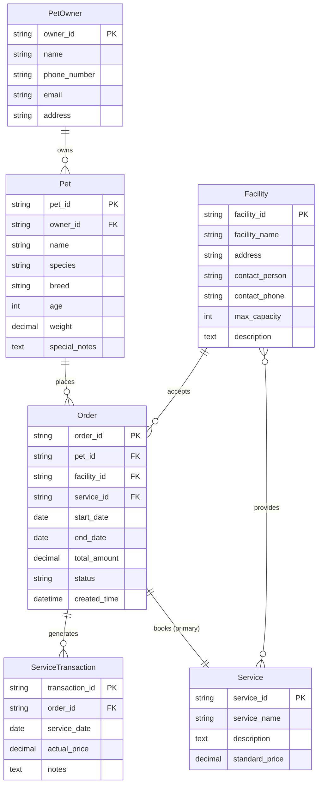

# 社区宠物寄养服务平台数据库设计文档(deprecated)

See [feishu document](https://ai.feishu.cn/wiki/KKh3wawa2i7FdLkf0QDcE5B1nwg)

## 1.需求说明

### 1.1 项目目标

设计并实现一个关系型数据库系统，以支持社区宠物寄养服务的日常运营与管理。该系统旨在清晰记录和关联寄养设施、宠物、主人、订单及服务交易信息，从而实现：

- 清晰的宠物标识：准确记录每只宠物的信息及其主人。
- 准确的订单匹配：将宠物、服务、设施和订单无缝关联。
- 有效的收入分析：基于服务交易数据进行多维度的营收统计与分析。

### 1.2 核心数据实体

系统需要管理以下核心信息：

- 宠物主人：使用服务的客户。
- 宠物：被寄养的对象，与主人关联
- 寄养设施：提供寄养服务的场所或个人（如家庭式寄养、专业寄养中心）。
- 服务项目：提供的服务类型（如：日常寄养、美容、训练等）及其定价。
- 订单：主人为宠物预约服务所创建的正式记录，包含时间、金额等信息。
- 服务交易：订单的具体执行记录，用于跟踪实际提供的服务和计算收入。

### 1.3 关键业务规则

- 一个宠物主人可以拥有多只宠物。
- 一只宠物在同一时间段内只能有一个有效的寄养订单。
- 一个寄养设施可以提供多种服务项目。
- 一个订单对应一只宠物和一项主要服务，但可以包含多个附加服务。
- 订单状态应能跟踪（如：待确认、进行中、已完成、已取消）。
- 交易记录需与订单关联，并记录实际服务日期，以便进行准确的收入核算。

## 2. 需求分析（系统分析与功能分析）

### 2.1 系统分析

本系统是一个典型的事务处理系统，核心是管理“寄养服务”这个核心业务流程中产生的数据流。数据来源于客户（主人）下单和设施提供方记录服务。

### 2.2 功能分析

基于需求，系统应支持以下主要功能，这些功能驱动了数据库的设计：

1. 客户与宠物管理

    - CRUD（增删改查）宠物主人信息（姓名、联系方式、地址）。
    - CRUD 宠物信息（名字、种类、品种、年龄、体重、特殊要求）。
    - 建立宠物与主人的所属关系。

2. 设施与服务管理

   - CRUD 寄养设施信息（设施名、地址、联系人、联系方式、容量、简介）。
   - CRUD 服务项目目录（服务名、描述、标准价格）。
   - 管理设施所能提供的服务（一个设施可提供多个服务，一个服务可由多个设施提供）。

3. 订单管理

   - 创建新订单：关联主人、宠物、设施、服务、寄养起止日期。
   - 自动计算订单金额（基于服务单价和寄养天数）。
   - 跟踪和更新订单状态。
   - 查询和检索历史订单。

4. 服务交易与财务管理

   - 根据已完成的订单或每日服务生成交易记录。
   - 按设施、服务类型、时间范围（日、月、年）统计收入。
   - 分析各设施的运营情况和热门服务。

## 3. 概念设计

概念设计使用实体-关系图来描述数据结构和它们之间的关系，独立于任何具体的数据库管理系统。

### 3.1 实体及其属性

- PetOwner（宠物主人）
  - `owner_id` (主键)
  - `name`
  - `phone_number`
  - `email`
  - `address`
- Pet（宠物）
  - `pet_id` (主键)
  - `owner_id` (外键，引用 PetOwner)
  - `name`
  - `species` (e.g., 狗， 猫)
  - `breed` (品种)
  - `age`
  - `weight`
  - `special_notes` (特殊说明，如过敏、行为习惯)
- Facility（寄养设施）
  - `facility_id` (主键)
  - `facility_name`
  - `address`
  - `contact_person`
  - `contact_phone`
  - `max_capacity` (最大容纳宠物数)
  - `description`
- Service（服务项目）
  - `service_id` (主键)
  - `service_name` (e.g., 日常寄养， 洗澡， 基础训练)
  - `description`
  - `standard_price` (标准价格)
- Order（订单）
  - `order_id` (主键)
  - `pet_id` (外键，引用 Pet)
  - `facility_id` (外键，引用 Facility)
  - `service_id` (外键，引用 Service) -- 主要服务
  - `start_date` (寄养开始日期)
  - `end_date` (寄养结束日期)
  - `total_amount` (订单总金额，可计算：standard_price * DATEDIFF(end_date, start_date))
  - `status` (状态：待确认/已确认/进行中/已完成/已取消)
  - `created_time` (下单时间)
- ServiceTransaction（服务交易）
  - `transaction_id` (主键)
  - `order_id` (外键，引用 Order)
  - `service_date` (服务提供日期)
  - `actual_price` (当日实际价格，允许与标准价不同，以应对调价)
  - `notes` (当日备注)

### 3.2 实体关系图

下图清晰地展示了实体之间的关系：

关系解释：

1. PetOwner owns Pet (1:N)： 一个主人可以拥有多只宠物，但一只宠物只能属于一个主人。
2. Facility provides Service (M:N)： 一个设施可以提供多种服务，一种服务也可以由多个设施提供。这是一个多对多关系，在物理设计时需要拆解为一个关联表 Facility_Service（图中未展开，但功能分析中已提及）。
3. Pet places Order (1:N)： 一只宠物可以有多个订单（历史订单），但一个订单只针对一只宠物。
4. Facility accepts Order (1:N)： 一个设施可以接收多个订单，但一个订单只指定一个设施。
5. Service booked by Order (N:1)： 一个订单主要预订一项服务（如“日常寄养”），而一项服务可以被多个订单预订。
6. Order generates ServiceTransaction (1:N)： 一个订单（尤其是多日寄养）会生成多条服务交易记录（每天一条），用于更精细的跟踪和收入确认。
